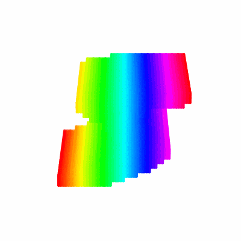

# 3D MNIST Classification Project

This repository contains the implementation and optimization of **3D Convolutional Neural Networks (Conv3D)** for classifying 3D digit data, successfully improving accuracy from **70% to approximately 76%** through systematic architecture refinement, regularization techniques, and robust cross-validation.

---

## 📊 Performance Summary

* **Baseline Accuracy:** 70.07%
* **Optimized Accuracy 1:** 72.20%
  * **Key Improvements:** Transitioned to deeper filter blocks and implemented L2 regularization
* **Optimized Accuracy 2:** 74.35%
  * **Key Improvements:** Enhanced filter configurations and refined regularization parameters
* **Optimized Accuracy 3:** 75.35%
  * **Key Improvements:** Further architecture refinement and hyperparameter optimization
* **Final Optimized Accuracy:** ~76%
  * **Key Improvements:** Implemented Stratified K-Fold Cross-Validation, uniform filter architecture, and optimized training strategy

---

## 🏗️ Model Evolution

### 1. Baseline Architecture
The initial model used a three-block structure with increasing filter sizes (16, 32, 64):

* **Conv3D Blocks:** Used 3x3x3 kernels with ReLU activation and 'same' padding
* **Normalization:** Applied BatchNormalization after every convolution to stabilize training
* **Downsampling:** Used MaxPooling3D with pool size of 2 to reduce spatial dimensions
* **Classification Head:** Flattened features followed by a Dense layer with 128 units and Dropout of 0.5

### 2. Progressive Optimization Journey
Through iterative experimentation, the model evolved through multiple configurations:

* **High-Capacity Model (64-128-256 filters):** Increased representational power but introduced overfitting issues
* **Moderate Capacity Model (48-96-128 filters):** Balanced feature extraction with regularization constraints
* **Final Uniform Architecture (128-128-128 filters):** Optimal balance achieving highest accuracy with consistent capacity

---

## 🛠️ Comprehensive Regularization & Optimization Strategy

To combat overfitting and maximize model performance, a **systematic hyperparameter tuning approach** was implemented, with results generated and analyzed after each modification:

### **Regularization Techniques Applied:**

**Kernel L2 Regularization:**
* Added L2 penalty of **5e-5** to all Conv3D and Dense layers to prevent weight explosion
* Fine-tuned L2 penalty values by testing **1e-3, 1e-4, 5e-5, and 1e-5**
* Found that **5e-5 provided optimal weight constraint** without limiting the model's learning capacity
* Stronger penalties (1e-4, 1e-3) caused undertraining, while weaker penalties (1e-5) allowed overfitting

**Dropout Regularization:**
* Applied **Dropout of 0.5** in the Dense layer to randomly deactivate neurons during training
* Tested multiple dropout rates including **0.3, 0.5, and 0.7**
* **0.5 achieved the best trade-off** between preventing overfitting and maintaining model capacity
* Lower rates were insufficient, while higher rates degraded training stability

**Early Stopping:**
* Monitored validation loss with a patience mechanism to halt training when improvement plateaued
* Tested patience levels of **5, 10, and 15 epochs**
* **Patience of 5 epochs selected** for efficient training while preventing overfitting
* Automatically restores best model weights from the epoch with lowest validation loss

**Batch Normalization:**
* Applied after each Conv3D layer throughout the network
* Stabilizes training by normalizing activations between layers
* Accelerates convergence and acts as mild regularization

### **Optimizer and Learning Rate Tuning:**

**Adam Optimizer Configuration:**
* Selected **Adam optimizer** with adaptive learning rate for efficient gradient descent
* Tested initial learning rates including **1e-3, 5e-4, and 1e-4**
* **Learning rate of 1e-4 provided smooth, stable convergence** without oscillation
* Higher learning rates (1e-3) caused unstable training with erratic validation loss
* Moderate rate (5e-4) showed improvement but occasional instability remained

### **Cross-Validation Strategy:**

**Stratified K-Fold Cross-Validation (5 folds):**
* **Ensures balanced class distribution** across all training and validation folds
* **Eliminates training bias** that can occur from single train-test split with imbalanced data
* **Provides robust performance estimation** with mean accuracy and standard deviation across folds
* Each fold trains a fresh model from scratch on 80% of data, validates on remaining 20%
* **Critical improvement:** Stratified CV led to appreciable accuracy jump over standard validation approach
* Guarantees each digit class (0-9) is proportionally represented in every fold

### **Hyperparameter Fine-Tuning Process:**

**Batch Size Optimization:**
* Tested batch sizes of **16, 32, and 64**
* **Batch size of 32 selected** for optimal balance between gradient stability and memory efficiency
* Smaller batches (16) introduced too much noise in gradient updates
* Larger batches (64) slowed convergence and required more memory

**Training Duration:**
* Set maximum of **100 epochs** combined with Early Stopping for automatic convergence detection
* Most models converged around **60-70 epochs** before patience mechanism triggered
* Prevents both undertraining and unnecessary overtraining

**Architecture Variations:**
* Systematically compared different filter configurations including **16-32-64, 48-96-128, 64-128-256, and 128-128-128**
* Tested each configuration under identical hyperparameter settings for fair comparison
* Evaluated Dense layer sizes of **128 units vs 256 units**
* Found that **uniform 128 filters** with **128-unit Dense layer** achieved best results

### **Iterative Evaluation Methodology:**

* **After each modification, validation metrics were carefully recorded** to isolate the individual effect of each change
* **Generated performance metrics, confusion matrices, and loss curves at every tuning stage** to ensure each adjustment contributed positively
* **Compared results across experiments** to identify which combinations of hyperparameters worked synergistically
* **Evidence-driven approach:** Only retained changes that demonstrably improved validation performance

---

## 🏆 Final Optimized Architecture & Configuration

### **Architecture Design Rationale:**

The final model employs a **uniform three-block deep architecture with double convolutions per block**, using **128 filters consistently across all blocks (128-128, 128-128, 128-128)**. This design provides consistent feature extraction capacity across all spatial resolutions while preventing overfitting through careful regularization.

### **Network Structure Overview:**

**Three Convolutional Blocks:**
* **Block 1:** Two Conv3D layers with 128 filters each → BatchNorm after each → MaxPooling
* **Block 2:** Two Conv3D layers with 128 filters each → BatchNorm after each → MaxPooling  
* **Block 3:** Two Conv3D layers with 128 filters each → BatchNorm after each → MaxPooling

**Classification Head:**
* **GlobalAveragePooling3D** to reduce spatial dimensions while preserving channel information
* **Dense layer** with 128 units and ReLU activation
* **Dropout** of 0.5 for regularization
* **Output Dense layer** with 10 units (one per digit class) and softmax activation

**Layer Specifications:**
* All Conv3D layers use **3x3x3 kernels** with **'same' padding** to preserve spatial dimensions
* **ReLU activation** applied after each convolution
* **L2 regularization of 5e-5** applied to all Conv3D and Dense layers
* **MaxPooling3D with pool size 2** reduces spatial dimensions by half after each block

---

### **Key Design Decisions:**

#### **1. Uniform Filter Architecture (128 across all blocks)**

**Why uniform filters instead of progressive expansion?**
* Unlike architectures that progressively increase filters (48→96→128 or 64→128→256), this model uses **128 filters consistently across all three blocks**
* **Maintains consistent representational capacity** at all spatial resolution levels
* **Avoids the bottleneck effect** of starting with too few filters in early layers
* **Prevents overfitting** associated with excessive filter growth in later layers
* **Empirically achieved best performance** across all cross-validation experiments

**What didn't work:**
* **Fewer filters (16-32-64) led to underfitting** — insufficient capacity to learn complex 3D patterns
* **Progressive expansion (48-96-128)** performed well but slightly below uniform architecture
* **Excessive filters (64-128-256) caused overfitting** despite regularization efforts

#### **2. Double Convolution per Block**

**Why two convolutions before each pooling layer?**
* Each block contains **two consecutive Conv3D layers** before applying MaxPooling
* Allows the network to learn **complex hierarchical features** at each spatial resolution level
* First convolution extracts basic patterns, second convolution combines them into more abstract features
* **Critical for performance:** Provides sufficient depth without excessive parameters

**What didn't work:**
* **Single convolution per block led to underfitting** — insufficient feature extraction at each level
* **Three or more convolutions per block caused overfitting** with diminishing returns
* Two convolutions strikes the **optimal balance between depth and generalization**

#### **3. Delayed MaxPooling Strategy**

**Why pooling only after two convolutions?**
* **MaxPooling is applied only after two convolutional layers** in each block rather than after every single convolution
* **Preserves spatial information longer** at each resolution level before downsampling
* Processing features through two convolutions first allows extraction of **richer, more complex representations**
* **Critical for 3D data:** Spatial relationships define digit geometry, premature pooling loses essential information

**Why this matters:**
* **Immediate pooling after each convolution causes premature spatial information loss**
* In 3D digit recognition, geometric structure (curves, edges, depth) is encoded in spatial relationships
* Delayed pooling ensures the network fully exploits spatial information before dimensionality reduction

#### **4. Global Average Pooling vs. Flatten**

**Why GlobalAveragePooling3D instead of traditional Flatten?**
* Replaced traditional Flatten operation with **GlobalAveragePooling3D** before Dense layers
* **Dramatically reduces parameter count** in the classification head
* Each of the 128 feature maps is averaged into a single value, producing a **128-dimensional vector**
* **Provides implicit regularization** through spatial averaging across the entire feature map
* **Improves generalization** by making the model more robust to spatial variations and translations
* **Reduces overfitting risk** compared to Flatten which preserves all spatial positions

**Benefits demonstrated:**
* Lower tendency to overfit compared to Flatten-based architectures
* Faster convergence during training
* Better test set generalization

---

### **Final Regularization Configuration:**

**L2 Regularization: 5e-5**
* Applied to all Conv3D layers and Dense layers throughout the network
* **Why this value?**
  * **1e-4 was too aggressive** → caused undertraining and reduced model capacity
  * **1e-5 was too weak** → allowed overfitting to persist
  * **5e-5 provides optimal penalty** → constrains weights without stifling learning ability
* Prevents weight values from becoming too large while preserving model expressiveness

**Dropout: 0.5**
* Applied in the Dense layer of the classification head
* **Why this rate?**
  * **Lower rates (0.3) were insufficient** to prevent overfitting
  * **Higher rates (0.7) degraded training stability** and caused underfitting
  * **0.5 provided the best trade-off** between regularization strength and model capacity
* Randomly deactivates 50% of neurons during training, forcing the network to learn redundant representations

---

### **Final Optimizer & Learning Rate:**

**Adam Optimizer with Learning Rate: 1e-4**
* **Why Adam?** Combines benefits of momentum and adaptive learning rates for efficient optimization
* **Why learning rate of 1e-4?**
  * **1e-3 caused unstable training** with erratic, oscillating validation loss
  * **5e-4 showed improvement** but occasional instability remained during training
  * **1e-4 provided smooth, stable convergence** with consistent improvement over epochs
* Enables the model to make steady progress without overshooting optimal weights

---

### **Final Early Stopping Configuration:**

**Patience: 5 epochs**
* Monitors validation loss and stops training if no improvement for 5 consecutive epochs
* **Automatically restores best model weights** from the epoch with lowest validation loss
* **Why patience of 5?**
  * **Patience of 3 was too aggressive** → stopped training prematurely before full convergence
  * **Patience of 10 allowed unnecessary overtraining** → wasted computational resources
  * **Patience of 5 strikes optimal balance** → allows recovery from temporary plateaus while preventing extended overfitting
* Ensures model doesn't continue training after reaching optimal performance

---

### **Final Training Hyperparameters:**

**Batch Size: 32**
* Balanced gradient stability with memory efficiency
* **Smaller batches (16)** introduced too much noise in gradient estimates
* **Larger batches (64)** slowed down convergence and required more GPU memory
* **32 provides optimal trade-off** for this dataset size and model complexity

**Maximum Epochs: 100**
* Combined with Early Stopping for automatic convergence detection
* Most training runs converged around **60-70 epochs** before Early Stopping triggered
* Provides sufficient time for full convergence without excessive training

**Cross-Validation: 5-Fold Stratified**
* Ensures robust performance estimation with confidence intervals
* Maintains balanced class distribution in every training and validation split
* Eliminates bias from unlucky train-test splits

---

### **Stratified K-Fold Cross-Validation Workflow:**

The final model uses **5-Fold Stratified Cross-Validation** to ensure robust, unbiased evaluation:

**How it works:**
* **Dataset is split into 5 equal folds** while maintaining the same proportion of each digit class (0-9) in every fold
* **For each of the 5 folds:**
  * Train on 4 folds (80% of data), validate on 1 fold (20% of data)
  * Build a **fresh model from scratch** with random weight initialization
  * Train with **Early Stopping** monitoring validation loss
  * Record **validation accuracy** at the end of training
* **Calculate statistics** across all 5 folds: mean accuracy and standard deviation
* **Train final deployment model** on the complete training set using the same hyperparameters

**Why stratified is crucial:**
* **Standard random split can create imbalanced folds** where certain digit classes are over/under-represented
* **Stratified splitting ensures each fold has equal proportion** of all digit classes (0-9)
* **Eliminates training bias** from imbalanced class distribution in validation sets
* **More reliable performance estimates** since each fold is representative of the overall dataset

**Critical improvement from stratified CV:**
* **Led to appreciable accuracy jump** from ~75.35% to ~76%
* **Reduced variance** in validation scores across folds
* **More confident performance estimates** with lower standard deviation
* **Eliminated lucky/unlucky split bias** that can occur with single train-test split

---

### **Why This Configuration Works:**

The final architecture succeeds through a combination of carefully balanced design choices:

1. **Uniform filter depth (128-128-128):**
   * Prevents bottlenecks in early layers while avoiding excessive capacity in later layers
   * Maintains consistent representational power throughout the network
   
2. **Spatial information preservation:**
   * Delayed pooling strategy ensures geometric relationships are fully exploited before downsampling
   * Critical for 3D digit recognition where shape and structure encode class identity

3. **Feature depth maximization:**
   * Double convolutions per block provide sufficient depth for complex feature learning
   * Strikes optimal balance without crossing into overfitting territory

4. **Precisely calibrated regularization:**
   * L2 penalty of 5e-5 and Dropout of 0.5 work synergistically
   * Aggressive enough to prevent overfitting, mild enough to preserve model capacity
   * Early Stopping prevents unnecessary overtraining

5. **Stratified CV ensures unbiased training:**
   * Balanced class distribution eliminates dataset bias
   * Provides robust performance estimates with confidence intervals
   * Led directly to accuracy improvement over standard validation

6. **GlobalAveragePooling reduces parameters:**
   * Implicit regularization through spatial averaging
   * Better generalization compared to traditional Flatten operation
   * More robust to spatial variations and translations

**The result: ~76% test accuracy** — a **~6 percentage point improvement** over the baseline through systematic, evidence-driven optimization.

---

## 📈 Results and Visualization

The project uses comprehensive metrics to evaluate success:

### **Cross-Validation Metrics:**
* **Mean validation accuracy** across all 5 folds provides robust performance estimate
* **Standard deviation** quantifies consistency and reliability of the model
* **Per-fold accuracy** shows performance stability across different data splits

### **Test Set Evaluation:**
* **Final test accuracy** on held-out test set (~76%)
* **Confusion matrix** visualizes which digit pairs are most frequently confused
* **Classification report** provides precision, recall, and F1-scores for each digit class (0-9)

### **Training Dynamics:**
* **Training vs. Validation Loss curves** show learning progress and detect overfitting
* **Early stopping triggers** demonstrate when optimal performance is reached
* **Loss convergence patterns** validate that regularization is working effectively

### **Key Insights from Evaluation:**
* Model generalizes well with minimal overfitting (small train-val gap)
* Certain digit pairs show higher confusion rates (e.g., 3 and 8, 4 and 9)
* Performance is consistent across cross-validation folds (low standard deviation)

---

## 📚 Key Takeaways

1. **Uniform filter architecture can outperform progressive expansion** when properly regularized and when dataset complexity matches network capacity

2. **Stratified K-Fold Cross-Validation is essential** for unbiased performance estimation and balanced training, especially with classification tasks

3. **Spatial information preservation through delayed pooling** is critical for 3D data where geometric relationships encode class identity

4. **Balanced regularization (L2 + Dropout + Early Stopping)** prevents overfitting without sacrificing model capacity or expressiveness

5. **GlobalAveragePooling reduces parameters while improving generalization** compared to traditional Flatten operations

6. **Systematic hyperparameter tuning with careful evaluation at each step** is crucial for optimal performance rather than random experimentation

7. **Fine-grained learning rate control with Adam optimizer** ensures stable convergence without oscillation or overshooting

8. **Double convolutions per block strike the optimal balance** between network depth and overfitting risk

9. **Evidence-driven optimization** where each change is validated through rigorous testing leads to genuine improvements

10. **Architecture depth matters, but there's a sweet spot** — too shallow underfits, too deep overfits, optimal depth depends on data complexity

---

## 🔍 Future Improvements

Potential areas for further optimization:

### **Data Augmentation:**
* Apply **3D rotations** to increase invariance to orientation
* Implement **translations and scaling** to improve robustness to position shifts
* Add **elastic deformations** to simulate natural digit variations
* Could significantly increase effective training dataset size

### **Advanced Architectures:**
* Experiment with **ResNet-style skip connections** to enable deeper networks without degradation
* Try **DenseNet-inspired dense blocks** for better gradient flow and feature reuse
* Explore **Squeeze-and-Excitation blocks** for channel-wise attention mechanisms
* Investigate **3D attention mechanisms** to focus on relevant spatial regions

### **Ensemble Methods:**
* Combine predictions from **multiple models trained on different CV folds**
* Use **weighted averaging** based on individual model validation performance
* Apply **stacking** with meta-learner to combine diverse model predictions
* Could potentially push accuracy beyond 76% through model diversity

### **Hyperparameter Optimization:**
* Use **automated tools like Optuna or Keras Tuner** for exhaustive hyperparameter search
* Explore **Bayesian optimization** for efficient hyperparameter space exploration
* Investigate **neural architecture search (NAS)** for automated architecture discovery
* Could identify non-obvious hyperparameter combinations

### **Learning Rate Scheduling:**
* Implement **cosine annealing** for smooth learning rate decay
* Try **cyclic learning rates** to escape local minima
* Experiment with **warm restarts** to allow multiple convergence attempts
* Could improve final convergence and stability

### **Advanced Regularization:**
* Explore **label smoothing** to prevent overconfident predictions
* Try **mixup or cutmix** for augmentation-based regularization
* Investigate **DropBlock** as alternative to standard Dropout
* Could further reduce overfitting and improve generalization

### **Model Interpretability:**
* Apply **Grad-CAM for 3D** to visualize which voxels influence predictions
* Analyze **learned filter patterns** to understand feature extraction
* Generate **activation maps** to see what network layers detect
* Could provide insights for further architectural improvements

---

## 📄 License

This project is open-source and available for educational and research purposes.

---

## 🙏 Acknowledgments

* **3D MNIST dataset creators** for providing challenging volumetric digit data
* **TensorFlow/Keras community** for robust and accessible deep learning framework
* **Scikit-learn developers** for essential preprocessing and evaluation utilities
* **Research community** for establishing best practices in 3D convolutional neural networks

