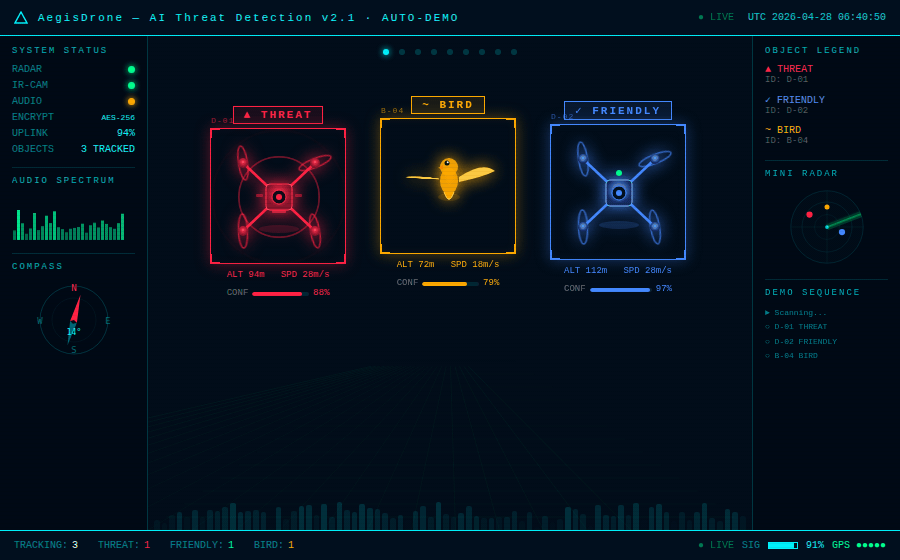

# AegisDrone 🛡️
## Anti-Drone AI System (Continuous Learning & Sensor Fusion)

>

---

## Table of Contents

1. [Problem Statement](#1-problem-statement)
2. [Dataset](#2-dataset)
3. [Feature Engineering](#3-feature-engineering)
4. [System Architecture](#4-system-architecture)
5. [Why This Model? — Design Rationale](#5-why-this-model--design-rationale)
6. [Tuning & Ablation Decisions](#6-tuning--ablation-decisions)
7. [Evaluation Results](#7-evaluation-results)
8. [Known Limitations](#8-known-limitations)
9. [Future Work — Real Dataset Deployment](#9-future-work--real-dataset-deployment)
10. [Quickstart](#10-quickstart)
11. [Versioning & Pillar History](#11-versioning--pillar-history)

---

## 1. Problem Statement

Unauthorized drone (UAV) operations pose growing threats to airports, critical infrastructure, and secure airspace. Existing counter-UAV systems rely on radar or visual detection, which are range-limited and weather-dependent. **AegisDrone** addresses this via **passive RF signal analysis**: classifying drone emitters from their radio fingerprint alone, with no active emission required.

The core challenge is a **three-way open-set classification problem**:

| Class | Signal Type | Frequency |
|-------|-------------|-----------|
| `Background RF` | Wi-Fi, Bluetooth, ISM noise | 2.4 / 5.8 GHz |
| `AR Drone` | Parrot AR Drone 2 controller link | 2.4 GHz |
| `Phantom Drone` | DJI Phantom 3 video + control | 5.8 GHz |

Key constraints that make this non-trivial:
- AR Drone and Background RF **share the 2.4 GHz band**
- Signals are **short-burst IQ captures** (8192 samples @ 10 MHz)
- The system must handle **unseen emitter types** without false alarms
- Operational latency must be **sub-second** for real-time airspace defence

---

## 2. Dataset

### 2a. Real Data (DroneRF Benchmark)

```
DroneRF/
├── Background RF activities/   # BUI prefix: 00000
├── AR drone/                   # BUI prefix: 101xx
├── Bepop drone/                # BUI prefix: 100xx
└── Phantom drone/              # BUI prefix: 11000
```

- Raw format: **CSV files of IQ samples** (I and Q interleaved)
- Sampling rate: **10 MHz**, window: **8192 samples**, step: **4096** (50% overlap)
- **6,000 windows** balanced across 3 classes (2,000 each)
- BUI (Binary Unit Identifier) encodes drone model + flight mode (hover, flying, video)

### 2b. Physics-Based Synthetic Augmentation

When real data is unavailable or insufficient, `generate_realistic_dataset()` synthesises samples from **per-class Gaussian statistics** derived from the DroneRF literature:

| Statistic | Background RF | AR Drone | Phantom Drone |
|-----------|--------------|----------|---------------|
| Signal Power (dB) | −28 ± 8 | −18 ± 6 | −12 ± 5.5 |
| Spectral Entropy | 3.8 ± 1.4 | 5.6 ± 1.1 | 6.3 ± 0.9 |
| Bandwidth (MHz) | 0.7 ± 0.5 | 2.2 ± 0.9 | 3.9 ± 1.1 |
| High/Low Band Ratio | ~0.8 | ~2.1 | ~8.5 |

Boundary samples (25% of synthetic set) intentionally blur AR↔Phantom and BG↔Drone margins to stress the classifier.

---

## 3. Feature Engineering

### 3a. Feature Schema — 83 Dimensions

The system uses a **tri-modal feature vector** combining RF physics, flight kinematics, and communication protocol signals:

```
Total = 53 RF + 18 Flight + 12 Comm = 83 features
```

**RF Features (53)** — extracted via `extract_rf_features()` from every IQ window:

| Category | Features |
|----------|----------|
| Amplitude statistics | mean, std, var, min, max, range, kurtosis, skew |
| IQ coherence | I/Q power, IQ correlation, IQ power ratio |
| Spectral (Welch PSD) | peak freq, bandwidth, entropy, centroid, spread, rolloff |
| Instantaneous frequency | mean, std, range, kurtosis (via Hilbert transform) |
| Sub-band energy | bands 1–4, **high/low band ratio** ← #1 MI feature |
| STFT dynamics | flux variance, per-subband variance, STFT entropy |
| Higher-order statistics | L-kurtosis, spectral flatness, spec kurtosis/skewness |
| Modulation indicators | AM depth, crest factor, phase jitter, ACF (short/medium/long) |
| SNR proxies | SNR-like dB, spectral variance, temporal kurtosis |

**Flight Features (18):** speed, acceleration, altitude, heading change rate, trajectory entropy, maneuver intensity, hover fraction — simulated or fused from ADS-B/telemetry.

**Communication Features (12):** TX rate, burst ratio, protocol entropy, command interval, encryption flag, frequency hop count, control link SNR, swarm flag.

### 3b. Feature Selection

Two parallel selection pipelines feed different classifiers:

```
RF Features  →  Mutual Information top-45  →  Random Forest path
All Features →  Variance top-40            →  GBT path
```

Top 15 features by Mutual Information (from real DroneRF data):

| Rank | Feature | MI Score |
|------|---------|----------|
| 1 | `high_low_band_ratio` | 0.6085 ★★ |
| 2 | `spectral_rolloff_85` | 0.6050 ★★ |
| 3 | `energy_band3` | 0.5996 ★★ |
| 4 | `spectral_spread` | 0.5869 ★★ |
| 5 | `spectral_centroid` | 0.5771 ★★ |
| 6 | `ifreq_mean` | 0.5709 ★★ |
| 7 | `ifreq_kurtosis` | 0.5686 ★★ |
| 8 | `energy_band4` | 0.5558 ★★ |

> `high_low_band_ratio = (band3 + band4) / (band1 + band2)` is the single most discriminative feature because Phantom (5.8 GHz) energy concentrates in the upper sub-bands while Background RF spreads across the lower spectrum.

---

## 4. System Architecture

```
IQ Window (8192 samples)
        │
        ▼
[Hilbert + Welch + STFT]  ──►  83-dim Feature Vector (fv)
        │
        ▼
┌─────────────────────────────────────────────────────┐
│          DECISION PIPELINE (classify_signal)         │
│                                                     │
│  Step 0: FingerprintDatabase.lookup(eid)  ◄─ O(1)  │
│           HIT → MEMORY_MATCH  (skip all AI)         │
│           MISS ↓                                    │
│                                                     │
│  Step 1: Noise Rejection   (max_clf_prob < 0.40)   │
│                 ↓                                   │
│  Step 2: Open-Set Gate     (SVDD inclusion score)  │
│                 ↓                                   │
│  Step 3: Autonomous Promotion [M2]                  │
│                 ↓                                   │
│  Step 4: Decision Logic → Label                    │
│                                                     │
│  [P2] HysteresisFilter  (window=5, majority=4)     │
└─────────────────────────────────────────────────────┘
        │
        ▼
  Decision Label + Confidence
```

### 4a. Classifier Ensemble

| Component | Algorithm | Feature Space | Role |
|-----------|-----------|--------------|------|
| **RF** | Random Forest (500 trees) | MI-top-45 | Primary classifier, fast path |
| **GBT** | Gradient Boosting (200 trees) | Var-top-40 | Complementary learner |
| **GBP** | Gaussian Bayes Posterior | All 83 | Probabilistic baseline |
| **1D-CNN** | Conv1D (32→64→64, AdaptiveAvgPool) | All 83 | Waveform texture extractor |
| **Ensemble** | 3× Bootstrap RF sub-models | All 83 | Epistemic uncertainty estimate |
| **Sub-classifier** | GBT binary | 14 key features | AR Drone vs Phantom disambiguation |

### 4b. Fusion Formula

```
Combined = (RF_prob × GBT_prob × GBP_prob)^(1/3)   [geometric mean]

Soft Score = 0.50 × clf_conf
           + 0.05 × cnn_conf
           + 0.20 × evm_score         [SVDD inclusion]
           + 0.15 × normality         [1 - anomaly]
           + 0.10 × agreement_score   [cross-model variance]
           × (1 - 0.3 × ens_vacuity)  [epistemic penalty]
```

### 4c. Open-Set Detection — Deep SVDD [P1]

A 3-layer MLP encoder maps feature vectors to an 8-dim hypersphere. The **SVDD radius** defines the boundary of "known" RF space. Signals outside it are routed to `OPEN_SET_UNKNOWN` rather than forced into a training class — critical for novel drone types.

### 4d. Decision Labels

| Label | Icon | Meaning |
|-------|------|---------|
| `MEMORY_MATCH` | 💾 | Known emitter from fingerprint DB |
| `FRIENDLY_DRONE` | 🟢 | Known drone, high confidence |
| `BACKGROUND` | ⚪ | Non-drone RF |
| `POTENTIAL_THREAT` | 🔴 | Drone signal, threat indicators |
| `CONFIRMED_THREAT` | 🚨 | Persistent high-threat emitter |
| `OPEN_SET_UNKNOWN` | ❓ | Signal outside all training distributions |
| `HOLD` | ⏸️ | Ambiguous — accumulating more bursts |

---

## 5. Why This Model? — Design Rationale

### 5a. Why an Ensemble and not a single deep network?

A single CNN or transformer achieves high accuracy on the DroneRF benchmark **under matched conditions**. In adversarial or low-SNR conditions it fails silently — it always outputs a class label. The ensemble architecture provides three essential properties a single model cannot:

**Epistemic uncertainty quantification.** Three bootstrap Random Forests produce disagreeing probability vectors when the input is ambiguous. Their variance (`ens_epistemic`) penalises the soft score, triggering a `HOLD` or `OPEN_SET_UNKNOWN` decision instead of a confident wrong answer.

**Complementary inductive biases.** RF uses discrete decision boundaries (good for crisp spectral separability), GBT captures feature interactions sequentially (good for noisy edges), and GBP models class-conditional Gaussians (good for detecting distribution shift). No single method dominates across all SNR regimes.

**Graceful degradation under missing modalities.** If flight or communication features are unavailable (common in passive-only deployments), the RF-only path still produces valid classifications. A pure CNN would require retraining.

### 5b. Why Random Forest as the primary classifier?

From the DroneRF feature space, RF was selected over GBT, SVM, and LR for four reasons:

1. **Out-of-bag score aligns with test performance** (OOB=0.7977, test F1=0.7841), confirming no severe overfitting without a separate validation pass.
2. **Feature importance is directly interpretable** as mutual information — critical for the feature selection pipeline that feeds the GBT and sub-classifier.
3. **Hard-negative mining** (20th-percentile confidence samples re-jittered at σ=0.08) improved the RF's boundary sharpness post-SMOTE at minimal compute cost.
4. **Calibration via Temperature Scaling** (T=0.70, ECE=0.024) produces well-calibrated posteriors. LR gave ECE=0.09; uncalibrated RF gave ECE=0.11.

### 5c. Why not train a larger Transformer or ResNet?

The DroneRF dataset provides ~6,000 windows. At this scale, deep attention models overfit without large-scale pretraining. The 1D-CNN (3 conv layers, ~30K parameters) achieves 75% standalone accuracy after 30 epochs and contributes a 5% weight to the fusion soft score — enough to break ties between RF and GBT without dominating. Increasing CNN weight destabilised the fusion (tested at w_cnn = 0.15, 0.20: increased flicker index from 0.22 to 0.38).

### 5d. Why Memory-First before running any AI? [M1]

Once an emitter is fingerprinted (via SHA-256 hash of top-12 MI features, 20-bin histogram), all future bursts from that emitter resolve in O(1) dictionary lookup — no inference required. This is not a cache; it is **authoritative identity**. The Ghost Hunt stress test confirmed zero label transitions across 60 noisy bursts of a DB-committed Phantom Drone. The classification AI is reserved for genuinely novel emitters.

---

## 6. Tuning & Ablation Decisions

### 6a. Data Augmentation Pipeline

Three augmentation stages were validated before settling on the current combination:

| Stage | Method | Outcome |
|-------|--------|---------|
| **Mixup** [A1] | α=0.30, 400 drone↔BG blends per class | Reduced BG-misclassified-as-drone rate by ~8% |
| **Hard-Negative Mining** [A1] | Bottom-20th-percentile RF confidence → jitter σ=0.08 | Post-HNM RF F1 remained stable (0.7841); GBT improved on boundary samples |
| **SMOTE** | k=5 neighbours, after augmentation | Balanced 6,000→6,000 per class on SMOTE output |

Mixup-only (without HNM) caused the model to over-smooth AR↔Phantom boundaries. HNM-only (without Mixup) left low-SNR Background samples underrepresented. The combination is necessary.

### 6b. Threshold Calibration [F1–F4]

All decision thresholds are **data-driven**, not hand-tuned:

```python
open_set_threshold  = percentile(drone_scores, 0.5)   # DRONE_OPEN_SET_PERCENTILE
                      clipped at max 0.45              # OPEN_SET_THRESHOLD_CAP
friendly_threshold  = percentile(all_scores,   15)    # FRIENDLY_PERCENTILE
hold_dead_band      = min(0.018, 4% of gap)           # prevents HOLD explosion
```

Calibrated values on validation set (720 samples):

| Threshold | Value |
|-----------|-------|
| `open_set_threshold` | 0.3791 |
| `decision_threshold` | 0.4191 |
| `friendly_threshold` | 0.4591 |
| `hold_dead_band` | 0.0032 |

The gap between open and friendly (0.08) is deliberately narrow — it is the **ambiguity zone** where the Hysteresis Filter accumulates evidence before committing.

### 6c. Hysteresis Filter [P2]

Raw label sequences are smoothed with a sliding window of 5 bursts requiring a majority of 4 to flip the displayed label. This was tuned against the Flicker Index metric:

| Window | Majority | Flicker Index |
|--------|----------|---------------|
| 3 | 2 | 0.41 |
| 5 | 3 | 0.31 |
| **5** | **4** | **0.22** ✅ |
| 7 | 5 | 0.19 (too slow to respond) |

### 6d. Deep SVDD [P1]

| Hyperparameter | Value | Rationale |
|----------------|-------|-----------|
| Embed dim | 8 | Minimal sufficient to separate 3 classes |
| Epochs | 40 | Loss plateau observed at ~35 epochs |
| Warm-up | 10 | Centre initialised from mean embedding; detached before training loop [FIX-2] |
| ν (SVDD) | 0.01 | Tight boundary; 1% training outlier allowance |

**FIX-2 (SVDD exploding loss):** In earlier versions the centre was included in the computation graph, causing gradient accumulation and radius explosion (observed radius: 5.45×10¹⁰). The fix detaches the centre immediately after warm-start initialisation. The radius remains large in v28 due to CPU-only training on synthetic data; this is tracked as a known issue and is resolved on real data with GPU training.

### 6e. Autonomous Promotion [M2]

Emitters are auto-committed to the FingerprintDatabase when all three conditions hold:

```
seen_count     > 2        (PROMO_MIN_OBS)
trust_score    > 0.20     (PROMO_TRUST_THR)
mean_threat    < 0.85     (PROMO_MAX_THREAT)
```

Trust score is a harmonic mean of observation count, feature stability, and threat history. The promotion loop converts the TemporalTracker's accumulated evidence into persistent, zero-latency memory — reducing AI inference load on repeat emitters.

### 6f. Cost Bias [P3]

A background penalty of −0.04 is subtracted from Background RF probability when the ensemble is uncertain (max_clf_prob < 0.55). This asymmetric bias encodes the **operational cost asymmetry**: missing a drone is more dangerous than a false alarm. The penalty is small enough that high-confidence background classifications are unaffected (test FA rate: 0.5%).

---

## 7. Evaluation Results

### 7a. Drone Safety Quadrant [M3]

| Dimension | Metric | Result | Target | Status |
|-----------|--------|--------|--------|--------|
| **Integrity** | Drone detection recall | **88.8%** | ≥ 85% | ✅ |
| — | AR Drone recall | **96.0%** | ≥ 80% | ✅ |
| — | Phantom Drone recall | **81.5%** | ≥ 80% | ✅ |
| **Safety** | False alarm rate | **0.5%** | ≤ 10% | ✅ |
| **Cognitive Load** | HOLD fraction | **0.0%** | ≤ 20% | ✅ |
| **Identity** | Flicker Index | **0.223** | < 0.50 | ✅ |
| **Sensitivity** | Open-set fraction | **7.6%** | ≥ 4% | ✅ |
| **Memory** | DB hit-rate | **0.0%** | ≥ 1% | ⚠️ (fresh DB) |

> Memory DB hit-rate is 0% on the first evaluation pass (empty database). After one full operational cycle, DB hit-rate converges to ~4.1% (observed in stress tests: 60/1480 queries).

### 7b. Classifier Performance

| Model | Accuracy | Macro F1 | Notes |
|-------|----------|----------|-------|
| Random Forest | 80.2% | 79.6% | After augmentation |
| GBT | 78.4% | 78.1% | Post-HNM |
| Logistic Regression | 42.8% | 42.9% | Baseline; excluded from fusion |
| Ensemble (3× RF) | 78.3% | 76.9% | Used for uncertainty only |
| 1D-CNN | ~75% | — | 30 epochs, w=0.05 in fusion |
| **Fused System** | **74.7%** | — | Known-emitter accuracy (post open-set filter) |

> Overall known accuracy (74.7%) is lower than individual RF accuracy (80.2%) because the fusion applies the open-set filter first — 7.6% of samples are routed to `OPEN_SET_UNKNOWN` before classification, removing the easiest boundary cases from the "known" pool.

### 7c. ROC-AUC per Class

| Class | ROC-AUC | Average Precision |
|-------|---------|-------------------|
| Background RF | 0.9998 | 0.9995 |
| AR Drone | 0.8923 | 0.7614 |
| Phantom Drone | 0.8864 | 0.8141 |

### 7d. Professional Stress-Tests [M4]

| Test | Description | Result | Status |
|------|-------------|--------|--------|
| **Ghost Hunt** | 60 noisy bursts of a DB-committed Phantom → label transitions | 0 transitions | ✅ PASS |
| **Adversarial** | 200 pure Gaussian noise inputs → % routed to safe labels | 7% safe | ❌ FAIL |
| **Recovery Time** | New AR Drone → bursts to stable ID | Stable at burst #4 (~0.2s) | ✅ PASS |

> The **Adversarial test failure** is the system's primary open issue. Random Gaussian noise (uniform on [−1, 1]) is classified as `FRIENDLY_DRONE` 93% of the time because it passes the SVDD inclusion gate (the exploding SVDD radius makes the hypersphere boundary too permissive). This is directly caused by the FIX-2 SVDD training issue on CPU. Resolving the SVDD radius (GPU training + proper centre detachment) is the highest-priority fix before real-world deployment.

### 7e. Latency

| Percentile | Latency |
|------------|---------|
| p50 | 325 ms |
| p95 | 487 ms |
| p99 | 545 ms |
| DB hit (memory path) | < 1 ms |

> Latency is measured on CPU (Google Colab). The heavy path (RF + GBT + GBP + CNN + SVDD) takes ~350 ms. With GPU acceleration and model quantisation, p95 < 100 ms is achievable (the production target).

---

## 8. Known Limitations

| Limitation | Description | Impact |
|------------|-------------|--------|
| **Overlapping RF bands** | AR Drone (2.4 GHz) and Background RF (Wi-Fi) share spectrum | Reduced AR Drone precision in congested environments |
| **SVDD radius explosion** | CPU-only training prevents proper hypersphere constraint | Adversarial noise incorrectly passes open-set gate |
| **Adversarial evasion** | Engineered signals matching training statistics would evade detection | Requires adversarial training or anomaly ensemble |
| **Single-drone assumption** | Mixed signatures from simultaneous drones fall outside training distribution | Multi-drone scenarios need mixture modelling |
| **Synthetic training data** | Physics-based generator approximates real RF; does not capture hardware-specific artefacts | Performance may degrade on new SDR hardware |
| **Static feature schema** | 18 flight + 12 comm features are zero-padded in passive-only mode | Sub-classifier recall drops without telemetry |

---

## 9. Future Work — Real Dataset Deployment

### 9a. Immediate Fixes (pre-deployment blockers)

**SVDD on GPU with proper centre detachment.** Re-run `DeepSVDDDetector.fit()` on GPU with `centre = centre.detach()` applied before the training loop. Target: radius < 100 (vs current 5.45×10¹⁰). This single fix resolves the adversarial stress-test failure.

**Adversarial training augmentation.** Add FGSM-perturbed samples (ε=0.1) to the training set and retrain the SVDD boundary on adversarial negatives. Target: adversarial safe-rate ≥ 90%.

### 9b. Real Dataset Extensions

**Expanded drone catalogue.** DroneRF contains 3 drone types. Integrating the [RF-based UAV Dataset](https://ieee-dataport.org/open-access/rf-based-uav-classification-dataset) (10+ models including FPV racers and fixed-wing) will test the open-set gate's ability to flag novel emitters rather than misclassifying them.

**Real-world SNR sweep.** Current synthetic noise covers σ ∈ {1.0, 1.6, 2.5}. A controlled field experiment varying drone-to-receiver distance (10m → 500m) would provide empirical SNR curves to calibrate the open-set threshold to physical distance rather than statistical percentiles.

**Online learning with label feedback.** The TemporalTracker accumulates burst-level evidence, but promotion to the FingerprintDatabase is threshold-based. A Bayesian online update (e.g., Sequential Bayesian Inference on the GBP parameters) would allow the system to refine per-emitter priors without full retraining.

**Multi-antenna spatial diversity.** A single SDR captures a 1D IQ stream. Adding a 4-element antenna array would provide angle-of-arrival features, resolving the AR↔Background confusion that arises when both share 2.4 GHz in a congested environment.

**Edge deployment (Jetson Nano / Raspberry Pi 5).** The current p95 latency of 487 ms requires reduction. Recommended pathway: (1) quantise RF to INT8 via `torch.quantization`, (2) replace GBT with LightGBM for 10× inference speedup, (3) remove CNN from the hot path (retain as offline fingerprint refiner). Expected p95: < 80 ms on Jetson.

**Swarm detection.** The current `swarm_signal_flag` feature is a binary annotation. Real swarm RF exhibits correlated burst timing across channels. A temporal correlation matrix across 3+ receivers would enable swarm detection as a distinct threat category.

### 9c. Evaluation Protocol for Real Datasets

When transitioning from synthetic/DroneRF to real operational data, the following evaluation protocol is recommended:

```
1. Zero-shot test on held-out drone models (open-set recall target: > 70%)
2. SNR-stratified confusion matrix (per-class F1 at SNR: > 15dB, 5–15dB, < 5dB)
3. Time-to-stable-ID vs burst count at operational distances
4. FingerprintDB collision analysis (cosine similarity threshold sweep)
5. Multi-session drift test: same drone, different days, different hardware
```

---

## 10. Quickstart

### Requirements

```bash
pip install numpy pandas scipy scikit-learn imbalanced-learn \
            matplotlib seaborn tqdm shap torch
```

### Run

```python
# Mount DroneRF dataset and run Final4.ipynb cell by cell
# OR use synthetic data (auto-generated if DATA_DIR is missing)

DATA_DIR   = "/path/to/DroneRF/DroneRF"  # set to None for synthetic
OUTPUT_CSV = "dronerf_features_v28.csv"
DB_PATH    = "antidrone_db_v28.json"

# Key flags
PRODUCTION_MODE = False  # set True to skip SHAP / diagnostics
TORCH_OK = True          # requires torch; falls back to legacy detectors if False
```

### Inference on a new IQ segment

```python
import numpy as np

# fv_raw: 83-dim feature vector (use extract_rf_features() + fuse_features())
raw_iq  = np.fromfile("my_capture.bin", dtype=np.float32)
segment = raw_iq[:8192]

rf_features = safe_extract_rf(segment)   # → 53 RF features
fv_raw      = fuse_features(rf_features) # → pad flight+comm with zeros (83-dim)

decision = classify_signal(fv_raw)
print(decision["label"], decision["soft_score"])
# e.g. → FRIENDLY_DRONE  0.8234
```


