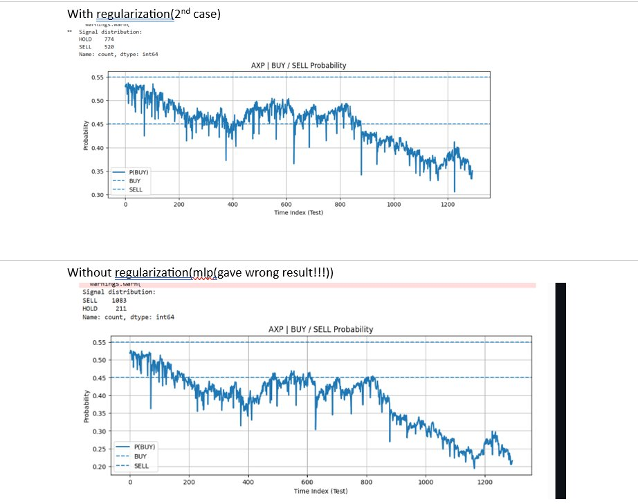

# Stock Buy/Sell/Hold Classifier

A machine learning project that predicts daily stock trading signals (BUY, SELL, HOLD) using Multi-Layer Perceptron (MLP) and LSTM neural networks. The classifier analyzes historical stock price data on a per-ticker basis to predict next-day return direction.

---

## Table of Contents

- [Overview](#overview)
- [Why Not Logistic Regression?](#why-not-logistic-regression)
- [Features](#features)
- [Model Architectures](#model-architectures)
- [Installation](#installation)
- [Configuration](#configuration)
- [Usage](#usage)
- [Code Implementation](#code-implementation)
- [Results & Findings](#results--findings)
- [Signal Generation](#signal-generation)
- [Visualization](#visualization)
- [Important Notes](#important-notes)

---

## Overview

This project implements a ticker-wise stock classifier that predicts whether to **BUY**, **SELL**, or **HOLD** a stock based on historical OHLCV (Open, High, Low, Close, Volume) data. The model predicts the direction of next-day returns for each stock independently.

### Key Features:
- **Per-ticker training**: Each stock gets its own trained model
- **Three-class signals**: BUY, SELL, or HOLD based on probability thresholds
- **Neural network approach**: MLP and LSTM architectures tested
- **Regularization techniques**: L2 regularization and early stopping to prevent overfitting

---

## Why Not Logistic Regression?

**Logistic regression was not used** because the features (Open, High, Low, Close, Volume) have **non-linear correlations** with the target variable (next-day return direction).

This was proven using **seaborn heatmap** correlation analysis, which showed that the relationship between OHLCV features and target is too complex for linear classification methods.

---

## Features

The model uses the following input features:

| Feature | Description |
|---------|-------------|
| **Open** | Opening price of the stock |
| **High** | Highest price during the trading day |
| **Low** | Lowest price during the trading day |
| **Close** | Closing price of the stock |
| **Volume** | Trading volume |

### Target Variable

- **Target**: Binary classification (0 or 1)
  - `1` = Next-day return is **positive** (price goes up)
  - `0` = Next-day return is **negative or zero** (price goes down/stays same)

The target is calculated as:
```python
df["Return_Next_Day"] = df.groupby("Ticker")["Close"].pct_change().shift(-1)
df["Target"] = (df["Return_Next_Day"] > 0).astype(int)
```

---

## Model Architectures

### 1. Multi-Layer Perceptron (MLP)

**Architecture:**
- Hidden layers: (64, 32) neurons
- Activation: ReLU
- Optimizer: Adam
- Learning rate: 0.001
- Batch size: 64
- Epochs: 20

**Two Versions Tested:**

#### Without Regularization
```python
model = MLPClassifier(
    hidden_layer_sizes=(64, 32),
    activation="relu",
    solver="adam",
    batch_size=64,
    learning_rate_init=0.001,
    max_iter=1,
    warm_start=True,
    shuffle=True,
    random_state=42
)
```
⚠️ **Result**: Gave wrong results due to overfitting

#### With Regularization (RECOMMENDED)
```python
model = MLPClassifier(
    hidden_layer_sizes=(64, 32),
    activation="relu",
    solver="adam",
    batch_size=64,
    learning_rate_init=0.001,
    alpha=1e-4,                 # L2 REGULARIZATION (CRITICAL)
    max_iter=1,
    warm_start=True,
    shuffle=True,
    early_stopping=True,        # STOP OVERFITTING
    validation_fraction=0.15,   # INTERNAL HOLDOUT
    n_iter_no_change=5,         # PATIENCE
    random_state=42
)
```
✅ **Result**: Significantly improved performance

### 2. LSTM (Long Short-Term Memory)

LSTM was also tested and showed **similar results to MLP with regularization**.

#### Why Choose LSTM Over MLP (Even Regularized)?

**An LSTM is not just "another neural net". It is a state machine with memory.**

It processes data sequentially:
```
Day₁ → Day₂ → Day₃ → ... → Dayₙ
```

**With gates that decide:**
- **What to remember** (long-term patterns)
- **What to forget** (irrelevant noise)
- **What to emphasize** (important signals)

**This matters because financial signals are conditional:**

| Scenario | Why Sequence Matters | MLP Limitation | LSTM Advantage |
|----------|---------------------|----------------|----------------|
| **Price Spike** | Only meaningful after consolidation | Sees spike in isolation | Remembers consolidation context |
| **Momentum** | Only matters if volatility stayed low | Cannot track volatility history | Gates track volatility sequence |
| **Threshold Crossing** | Meaning depends on what led up to it | No memory of prior states | Maintains state of lead-up events |

**Key Insight:**
> An MLP cannot express "this happened **after** that". An LSTM can.

**Example:**
```
Scenario: Stock price crosses $100

MLP sees: [Open=99, High=101, Low=98, Close=100, Volume=1M]
         ↓
      Just numbers → Generic prediction

LSTM sees: [Day -5: consolidating at $95]
          [Day -4: slow climb to $96]
          [Day -3: volume increasing]
          [Day -2: broke $98 resistance]
          [Day -1: pullback to $99]
          [Today: crossed $100 with volume]
         ↓
      Sequential pattern → Context-aware prediction
```

**Why This Architecture Was Chosen:**
- **Temporal Dependencies**: Stock prices are inherently sequential
- **Pattern Recognition**: LSTM captures "setup" patterns (consolidation → breakout)
- **Contextual Signals**: The same price move means different things in different contexts
- **Memory Gates**: Learns which historical patterns matter for prediction

---

## Installation

### Prerequisites
```bash
pip install pandas numpy matplotlib scikit-learn seaborn
```

### For LSTM (if using):
```bash
pip install tensorflow  # or pytorch
```

---

## Configuration

Key configuration parameters:

```python
CSV_PATH = "World-Stock-Prices-Dataset.csv"
FEATURES = ["Open", "High", "Low", "Close", "Volume"]
HIDDEN_LAYERS = (64, 32)
ACTIVATION = "relu"
LEARNING_RATE = 0.001
EPOCHS = 20
TEST_SIZE = 0.2
MIN_ROWS = 500              # Minimum rows per ticker (critical for stability)
BUY_THRESHOLD  = 0.55       # Probability threshold for BUY signal
SELL_THRESHOLD = 0.45       # Probability threshold for SELL signal
RANDOM_STATE = 42
```

### Threshold Explanation:
- **P(BUY) > 0.55** → Generate **BUY** signal
- **P(BUY) < 0.45** → Generate **SELL** signal
- **0.45 ≤ P(BUY) ≤ 0.55** → Generate **HOLD** signal

---

## Usage

### 1. Data Loading and Preprocessing

```python
# Load dataset
df = pd.read_csv(CSV_PATH)
df["Date"] = pd.to_datetime(df["Date"], errors="coerce", utc=True)
df = df.sort_values(["Ticker", "Date"]).reset_index(drop=True)
df[FEATURES] = df[FEATURES].apply(pd.to_numeric, errors="coerce")
```

### 2. Target Generation

```python
# Calculate next-day returns
df["Return_Next_Day"] = df.groupby("Ticker")["Close"].pct_change().shift(-1)
df["Target"] = (df["Return_Next_Day"] > 0).astype(int)
df = df.dropna(subset=FEATURES + ["Target"])
```

### 3. Ticker-wise Training

```python
results = {}
for ticker, g in df.groupby("Ticker"):
    if len(g) < MIN_ROWS:
        continue
    
    # Feature and target arrays
    X = g[FEATURES].values
    y = g["Target"].values
    
    # Time-based split (80% train, 20% test)
    split = int(len(g) * (1 - TEST_SIZE))
    X_train, X_test = X[:split], X[split:]
    y_train, y_test = y[:split], y[split:]
    
    # Scaling per ticker (NON-NEGOTIABLE)
    scaler = StandardScaler()
    X_train = scaler.fit_transform(X_train)
    X_test  = scaler.transform(X_test)
    
    # Train model...
```

### 4. Signal Generation

```python
# Get probabilities
test_probs = model.predict_proba(X_test)[:, 1]

# Generate signals
signals = np.where(
    test_probs > BUY_THRESHOLD, "BUY",
    np.where(test_probs < SELL_THRESHOLD, "SELL", "HOLD")
)

# Show distribution
print(pd.Series(signals).value_counts())
```

---

## Code Implementation

### Full MLP Implementation (With Regularization)

```python
import pandas as pd
import numpy as np
import matplotlib.pyplot as plt
from sklearn.neural_network import MLPClassifier
from sklearn.preprocessing import StandardScaler
from sklearn.metrics import accuracy_score, classification_report

# Load and preprocess data
df = pd.read_csv("World-Stock-Prices-Dataset.csv")
df["Date"] = pd.to_datetime(df["Date"], errors="coerce", utc=True)
df = df.sort_values(["Ticker", "Date"]).reset_index(drop=True)
df[FEATURES] = df[FEATURES].apply(pd.to_numeric, errors="coerce")

# Create target
df["Return_Next_Day"] = df.groupby("Ticker")["Close"].pct_change().shift(-1)
df["Target"] = (df["Return_Next_Day"] > 0).astype(int)
df = df.dropna(subset=FEATURES + ["Target"])

# Train per ticker
results = {}
for ticker, g in df.groupby("Ticker"):
    if len(g) < 500:
        continue
    
    print(f"\n===== {ticker} | rows: {len(g)} =====")
    
    # Prepare data
    X = g[FEATURES].values
    y = g["Target"].values
    split = int(len(g) * 0.8)
    X_train, X_test = X[:split], X[split:]
    y_train, y_test = y[:split], y[split:]
    
    # Scale
    scaler = StandardScaler()
    X_train = scaler.fit_transform(X_train)
    X_test  = scaler.transform(X_test)
    
    # Model with regularization
    model = MLPClassifier(
        hidden_layer_sizes=(64, 32),
        activation="relu",
        solver="adam",
        batch_size=64,
        learning_rate_init=0.001,
        alpha=1e-4,
        max_iter=1,
        warm_start=True,
        shuffle=True,
        early_stopping=True,
        validation_fraction=0.15,
        n_iter_no_change=5,
        random_state=42
    )
    
    # Train with epoch tracking
    for epoch in range(20):
        model.fit(X_train, y_train)
        test_probs = model.predict_proba(X_test)[:, 1]
        test_preds = (test_probs > 0.55).astype(int)
        test_acc = accuracy_score(y_test, test_preds)
    
    results[ticker] = test_acc
    
    # Generate signals
    signals = np.where(
        test_probs > 0.55, "BUY",
        np.where(test_probs < 0.45, "SELL", "HOLD")
    )
    print("Signal distribution:")
    print(pd.Series(signals).value_counts())

# Final summary
print("\n===== FINAL TICKER-WISE ACCURACY =====")
for t, a in results.items():
    print(f"{t}: {a:.3f}")
```

---

## Results & Findings

### Model Comparison

| Model | Regularization | Result | Why? |
|-------|---------------|--------|------|
| **MLP** | ❌ Without | ⚠️ Wrong results (overfitting) | No regularization, memorizes noise |
| **MLP** | ✅ With L2 + Early Stopping | ✅ Good performance | Prevents overfitting |
| **LSTM** | ✅ With Regularization | ✅ Similar to MLP (but better for sequences) | **Memory + Context awareness** |
| **LSTM** | ❌ Without | Not documented | - |

### Why LSTM Is Preferred (Even With Similar Accuracy):

While LSTM and regularized MLP achieve similar accuracy scores, **LSTM has architectural advantages** for time-series financial data:

1. **Sequential Processing**: Processes day-by-day, maintaining temporal order
2. **Conditional Understanding**: Knows "this happened after that"
3. **Context-Aware Predictions**: Same price move interpreted differently based on history
4. **Pattern Memory**: Remembers setups like consolidation → breakout sequences

**Conclusion**: Choose LSTM when you need the model to understand **temporal patterns and context**, not just input-output mappings.

### Key Observations:

1. **Regularization is critical**: Without it, the model overfits and produces unreliable predictions
2. **LSTM preferred over MLP**: While both achieve similar accuracy when regularized, LSTM understands temporal context and sequential dependencies—crucial for financial data
3. **LSTM = State Machine with Memory**: Processes day→day→day with gates that remember patterns, forget noise, and emphasize signals
4. **Financial signals are conditional**: Price movements mean different things depending on what preceded them (consolidation, momentum, volatility history)
5. **Per-ticker scaling is non-negotiable**: Each stock has different price ranges and must be scaled independently
6. **Minimum data requirement**: At least 500 rows per ticker needed for stable training

---

## Signal Generation

Signals are generated based on probability thresholds:

```python
signals = np.where(
    test_probs > 0.55, "BUY",      # High confidence price will rise
    np.where(test_probs < 0.45, "SELL", "HOLD")  # Low confidence or neutral
)
```

### Example Output:
```
Signal distribution:
HOLD    45
BUY     32
SELL    23
```

---

## Visualization

The code generates probability plots for each ticker:

```python
plt.figure(figsize=(12, 4))
plt.plot(test_probs, label="P(BUY)", linewidth=2)
plt.axhline(0.55, linestyle="--", label="BUY THRESHOLD")
plt.axhline(0.45, linestyle="--", label="SELL THRESHOLD")
plt.title(f"{ticker} | BUY / SELL Probability")
plt.xlabel("Time Index (Test)")
plt.ylabel("Probability")
plt.legend()
plt.grid(True)
plt.show()
```

**What the plot shows:**
- Blue line: Predicted probability of price increase
- Dashed lines: Decision thresholds
- When probability crosses thresholds, signals change

---

## Important Notes

### Critical Design Decisions:

1. **Per-Ticker StandardScaler (NON-NEGOTIABLE)**
   ```python
   # ✅ CORRECT: Fit scaler per ticker
   scaler = StandardScaler()
   X_train = scaler.fit_transform(X_train)
   X_test = scaler.transform(X_test)
   ```
   - Each stock has different price scales
   - Prevents data leakage between tickers
   - Essential for accurate predictions

2. **Time-Based Split**
   - Use chronological split (not random)
   - Train on historical data, test on recent data
   - Simulates real-world trading scenario

3. **Minimum Row Requirement**
   - Skip tickers with < 500 rows
   - Ensures statistical stability
   - Prevents overfitting on small datasets

4. **Regularization Parameters**
   - `alpha=1e-4`: L2 penalty to prevent overfitting
   - `early_stopping=True`: Stop when validation performance degrades
   - `validation_fraction=0.15`: Use 15% of training for validation
   - `n_iter_no_change=5`: Patience before stopping

---

## Known Issues


1. **Discrepancy 1 & 2**: Document mentions discrepancies but doesn't detail them

3. **Without regularization produces wrong results**: Always use regularized version
---

## Future Improvements

- Add feature engineering (technical indicators, moving averages)
- Implement walk-forward validation
- Test ensemble methods
- Add risk management metrics (Sharpe ratio, drawdown)
- Include transaction costs in backtesting
- Experiment with different threshold values
- Add class balancing techniques

